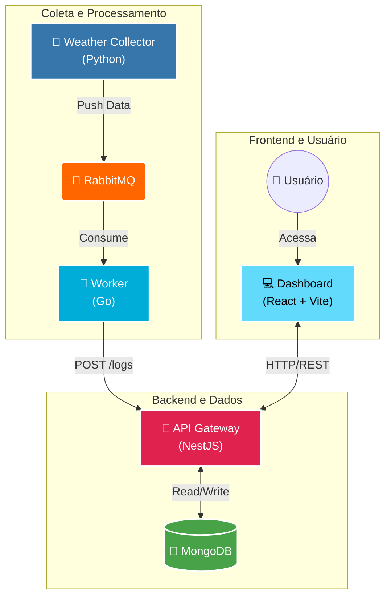
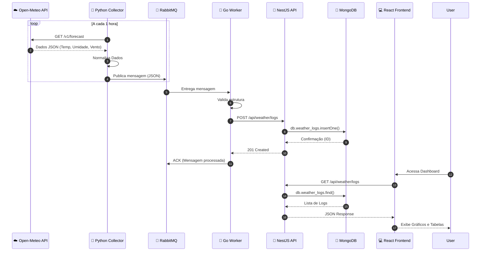

# 🌦️ GDASH Weather Challenge


Uma solução **Full-Stack** moderna e distribuída para coleta, processamento e visualização de dados climáticos em tempo real. Este projeto demonstra uma arquitetura de microsserviços orquestrada via Docker, integrando múltiplas linguagens (Python, Go, TypeScript) e tecnologias.

---

## 🏗️ Arquitetura do Sistema

A solução é composta por 4 serviços principais que se comunicam de forma assíncrona e síncrona para garantir escalabilidade e resiliência.



---

## 🔄 Fluxo de Dados

O diagrama abaixo ilustra o ciclo de vida de um registro climático, desde a coleta na API externa até a visualização no dashboard.



---

## 🧩 Componentes do Projeto

### 1. 🐍 Weather Data Collector (Python)
**Responsabilidade:** Coletar dados brutos de fontes externas.
- **Stack:** Python 3.13, `requests`, `pika` (RabbitMQ client).
- **Funcionamento:** Um script que roda em loop (cron job simulado), consulta a API Open-Meteo para obter dados climáticos da localização configurada e publica esses dados brutos na fila `weather_data` do RabbitMQ.

### 2. 🐹 RabbitMQ Worker (Go)
**Responsabilidade:** Processamento de alta performance e desacoplamento.
- **Stack:** Go 1.25, `amqp091-go`.
- **Funcionamento:** Consome mensagens da fila `weather_data`. Sua função é garantir que os dados sejam entregues à API principal. Ele implementa lógica de retry e confirmação (ACK) apenas após o sucesso da requisição HTTP para a API.

### 3. 🦅 Backend API (NestJS)
**Responsabilidade:** Regras de negócio, persistência e segurança.
- **Stack:** Node.js, NestJS, Mongoose, JWT, Swagger.
- **Funcionalidades:**
  - **Auth:** Autenticação JWT e gerenciamento de usuários.
  - **Weather:** Recebe logs do Worker, armazena no MongoDB e serve dados filtrados para o frontend.
  - **Insights:** Gera análises estatísticas sobre os dados históricos.
  - **Export:** Gera relatórios em CSV e XLSX.

### 4. 💻 Frontend Dashboard (React)
**Responsabilidade:** Visualização de dados e interação do usuário.
- **Stack:** React, Vite, Tailwind CSS, shadcn/ui, Recharts.
- **Funcionalidades:**
  - Dashboard interativo com gráficos e tabelas.
  - Filtros avançados por data e paginação.
  - Modo Escuro/Claro (Dark Mode).
  - Sistema de notificações (`sonner`).
  - Integração com API de Star Wars (via Proxy no Backend).

---

## 🚀 Como Rodar o Projeto

### Pré-requisitos
- **Docker** e **Docker Compose** instalados.

### Passo a Passo

1. **Clone o repositório:**
   ```bash
   git clone https://github.com/eliezerlobaton/gdash-weather-challenge.git
   cd gdash-weather-challenge
   ```

2. **Configure as variáveis de ambiente:**
   Crie um arquivo `.env` na raiz baseado no exemplo (ou use os valores padrão para dev):
   ```bash
   cp .env.example .env
   ```

3. **Suba os containers:**
   ```bash
   docker compose up -d --build
   ```
   *Isso irá construir as imagens e iniciar todos os serviços (Frontend, API, Worker, Collector, RabbitMQ, MongoDB).*

4. **Acesse a aplicação:**
   - **Frontend:** [http://localhost](http://localhost)
   - **API Docs (Swagger):** [http://localhost:3000/api/docs](http://localhost:3000/api/docs)
   - **RabbitMQ Admin:** [http://localhost:15672](http://localhost:15672) (User: `guest`, Pass: `guest`)

---

## 🛠️ Integração Contínua (CI)

O projeto conta com um pipeline de CI configurado via **GitHub Actions** (`.github/workflows/ci.yml`) que garante a qualidade do código em todos os níveis:

| Serviço | Verificações |
|---------|--------------|
| **Frontend** | Instalação, Linting (ESLint), Build (Vite) |
| **Backend** | Instalação, Linting, Build (NestJS) |
| **Worker (Go)** | Setup Go, Download Modules, Build |
| **Collector (Python)** | Setup Python, Instalação, Linting (Flake8) |

O pipeline é acionado automaticamente em **Push** e **Pull Requests** para a branch `main`.

---

## 📂 Estrutura de Diretórios

```
.
├── packages/
│   ├── gdash-api/            # Backend NestJS
│   ├── gdash-frontend/       # Frontend React
│   ├── rabbitmq-worker/      # Worker em Go
│   └── weather-data-collector/ # Script Python
├── .github/
│   └── workflows/            # Configuração de CI
├── compose.yml               # Orquestração Docker
└── README.md                 # Documentação
```

---

Feito com 💜 para o desafio **GDASH**.
