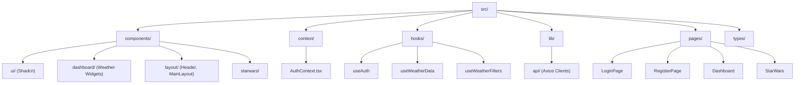
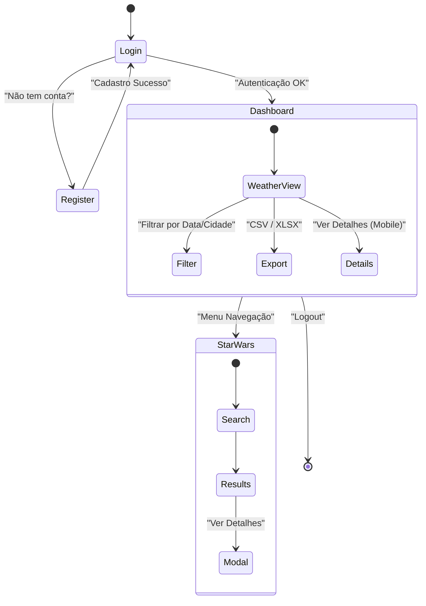
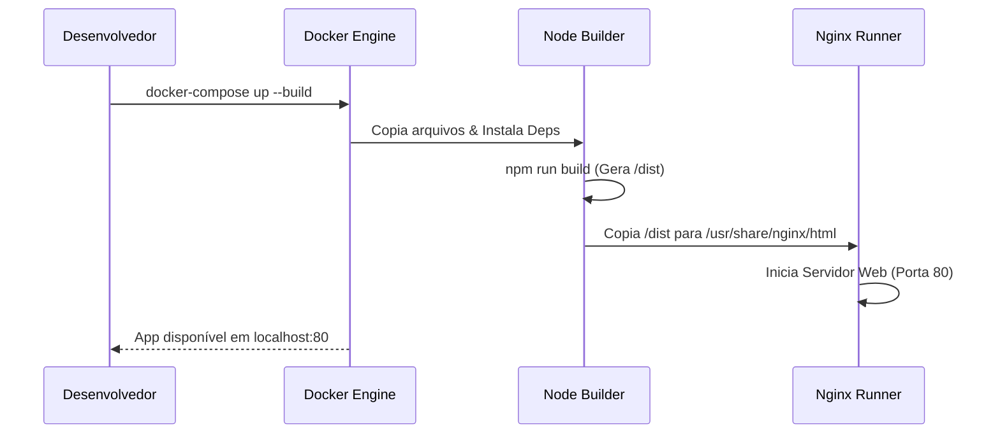

# 🌦️ GDash Weather Dashboard (Frontend)

Este é o frontend da aplicação **GDash Weather Challenge**, uma interface moderna e responsiva para visualização de dados meteorológicos e exploração do universo Star Wars.

Construído com **React**, **Vite** e **Tailwind CSS**, o projeto foca em performance, acessibilidade e uma experiência de usuário premium.

## 🚀 Tecnologias Utilizadas

*   **Core:** [React](https://react.dev/) (v18), [Vite](https://vitejs.dev/)
*   **Linguagem:** [TypeScript](https://www.typescriptlang.org/)
*   **Estilização:** [Tailwind CSS](https://tailwindcss.com/), [Next Themes](https://github.com/pacocoursey/next-themes) (Dark Mode)
*   **Componentes:** [Shadcn/UI](https://ui.shadcn.com/) (baseado em Radix UI)
*   **Notificações:** [Sonner](https://sonner.emilkowal.ski/)
*   **Ícones:** [Lucide React](https://lucide.dev/)
*   **Gráficos:** [Recharts](https://recharts.org/)
*   **Rotas:** [React Router DOM](https://reactrouter.com/)
*   **Requisições:** [Axios](https://axios-http.com/)
*   **Datas:** [Date-fns](https://date-fns.org/)

## 📂 Estrutura do Projeto

Abaixo, a estrutura de diretórios principal do frontend:



## 🔄 Fluxo da Aplicação

O diagrama abaixo ilustra o fluxo de navegação do usuário:



## 🛠️ Instalação e Execução Local

### Pré-requisitos
*   Node.js (v18+)
*   npm ou pnpm

### Passos

1.  **Clone o repositório:**
    ```bash
    git clone https://github.com/eliezerlobaton/gdash-weather-challenge.git
    cd gdash-weather-challenge/packages/gdash-frontend
    ```

2.  **Instale as dependências:**
    ```bash
    npm install
    # ou
    pnpm install
    ```

3.  **Configure as variáveis de ambiente:**
    Crie um arquivo `.env` na raiz do pacote `packages/gdash-frontend` (ou use o da raiz do monorepo se configurado):
    ```env
    VITE_API_URL=http://localhost:3000/api
    VITE_STARWARS_API_URL=https://swapi.dev/api
    ```

4.  **Inicie o servidor de desenvolvimento:**
    ```bash
    npm run dev
    ```
    O app estará disponível em `http://localhost:5173`.

## 🐳 Execução com Docker

O frontend possui um `Dockerfile` otimizado em duas etapas (Build + Nginx).



Para rodar via Docker (recomendado usar o `docker-compose.yml` da raiz):

```bash
docker-compose up --build weather-dashboard
```

## 📱 Responsividade e UX

O projeto foi desenhado com **Mobile First** e foco em UX:
*   **Tema:** Suporte a Dark/Light mode com persistência.
*   **Notificações:** Feedback visual rico com `sonner` (sucesso, erro, info).
*   **Dashboard:** Tabelas se adaptam, ocultando colunas menos relevantes em telas pequenas.
*   **Interatividade:** Modais e Dialogs substituem tooltips em dispositivos touch.
*   **Menu:** Header adaptativo com menu hambúrguer.

---
Desenvolvido como parte do **GDash Weather Challenge**.
