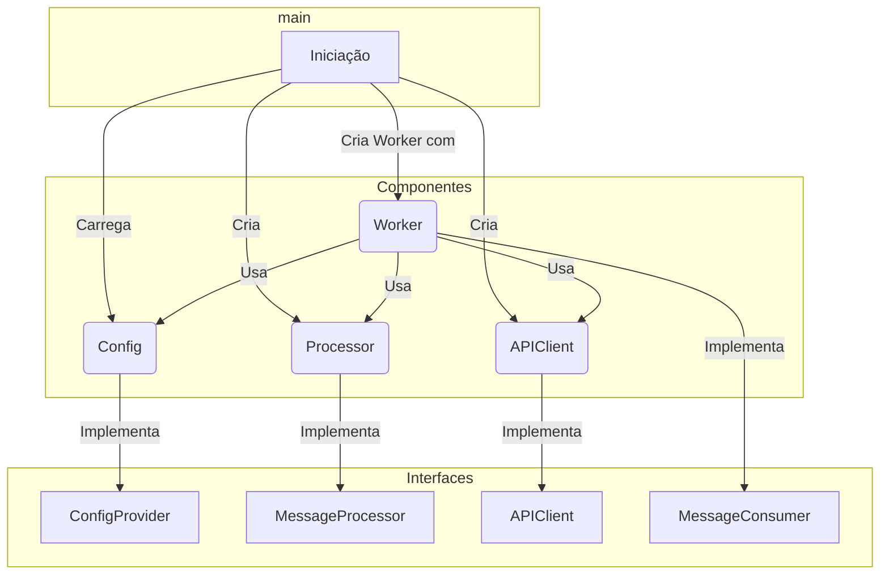
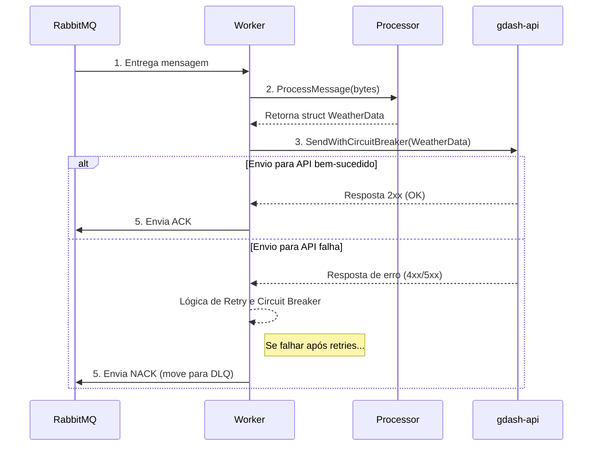
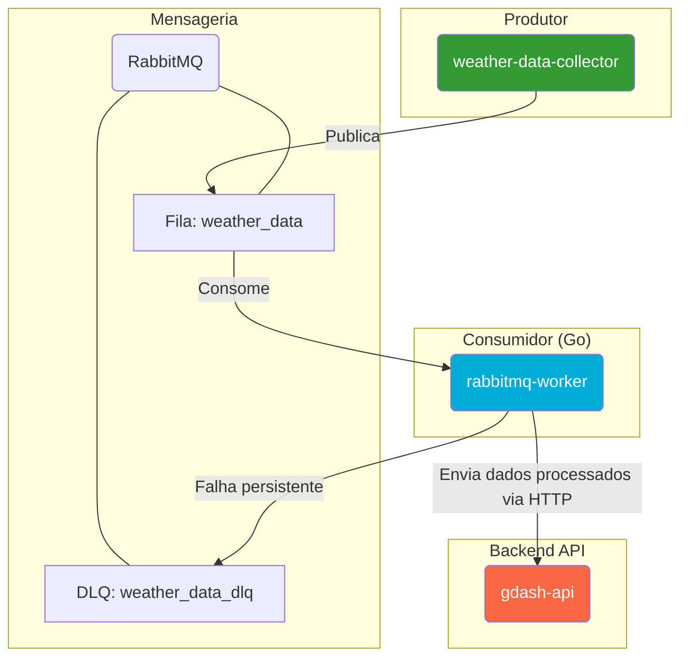

# RabbitMQ Worker (Go)

Este serviço, desenvolvido em Go, atua como um consumidor de mensagens (worker) no ecossistema GDash. Sua principal função é escutar uma fila no RabbitMQ, processar as mensagens de dados climáticos recebidas e, em seguida, enviá-las para uma API de backend para persistência e análise.

## Visão Geral e Arquitetura

O worker foi construído com foco em performance, resiliência e boas práticas de desenvolvimento em Go. A utilização de interfaces e injeção de dependência permite um código desacoplado, modular e fácil de testar.

### Principais Componentes

-   **`main.go`:** Ponto de entrada da aplicação. É responsável por carregar a configuração, instanciar as dependências, iniciar o worker e gerenciar o encerramento gracioso (graceful shutdown).
-   **`worker/worker.go`:** O coração do consumidor. Implementa a lógica para conectar-se ao RabbitMQ, consumir mensagens da fila, orquestrar o processamento e garantir a entrega.
-   **`worker/processor.go`:** Responsável por validar, desserializar (de JSON para struct Go) e transformar as mensagens recebidas.
-   **`api/client.go`:** Um cliente HTTP robusto para comunicar-se com a API de backend (neste caso, a `gdash-api`). Implementa padrões de resiliência como Retry e Circuit Breaker.
-   **`internal/interfaces/`:** Define as interfaces (contratos) que garantem o desacoplamento entre os pacotes.

### Diagrama de Arquitetura Interna

O diagrama abaixo mostra como os componentes são instanciados e injetados em `main.go`, promovendo a separação de responsabilidades.



## Fluxo de Processamento de Mensagem

Quando uma mensagem chega na fila `weather_data`, o seguinte fluxo é acionado:

1.  **Consumo:** O `Worker` recebe a mensagem do RabbitMQ.
2.  **Processamento:** A mensagem (em bytes) é enviada para o `Processor`, que a transforma em uma struct `models.WeatherData` e adiciona um timestamp de processamento.
3.  **Envio para API:** O `Worker` chama o `APIClient` para enviar os dados processados para a `gdash-api`.
4.  **Resiliência:** Se o envio falhar, o `APIClient` tenta reenviar a requisição algumas vezes (Retry). Se as falhas persistirem, o Circuit Breaker é ativado para proteger a API.
5.  **Confirmação (ACK/NACK):**
    -   Se todo o processo for bem-sucedido, o worker envia um `ACK` (Acknowledgement) para o RabbitMQ, e a mensagem é removida da fila.
    -   Se ocorrer um erro irrecuperável ou o número de tentativas for excedido, um `NACK` (Negative Acknowledgement) é enviado, e a mensagem é movida para uma Dead Letter Queue (DLQ).



## Integração no Ecossistema

Este serviço atua como um **Consumidor** de dados, fazendo a ponte entre o barramento de eventos (RabbitMQ) e a camada de aplicação/persistência (`gdash-api`).



## Padrões de Resiliência

Para garantir a robustez do sistema, o worker implementa vários padrões:

-   **Retry com Backoff Exponencial:** O `api/client.go` tenta reenviar requisições falhas para a API, aumentando o tempo de espera entre as tentativas para não sobrecarregar o serviço de destino.
-   **Circuit Breaker:** Se a API de destino apresentar falhas consecutivas, o cliente "abre o circuito" e para de enviar requisições por um tempo, evitando chamadas que certamente falhariam. Após um período, ele tenta novamente em um estado de "meio-aberto".
-   **Dead Letter Queue (DLQ):** Mensagens que falham repetidamente no processamento são movidas para uma fila especial (`weather_data_dlq`). Isso impede que uma mensagem "venenosa" bloqueie o processamento de outras mensagens válidas e permite que a falha seja analisada posteriormente.

## Configuração

O worker é configurado via variáveis de ambiente.

| Variável de Ambiente | Descrição | Padrão |
| ------------------- | ----------------------------------------------------------- | ------------------------ |
| `RABBITMQ_HOST` | Hostname do servidor RabbitMQ. | `localhost` |
| `RABBITMQ_QUEUE` | Nome da fila a ser consumida. | `weather_data` |
| `API_URL` | URL base da API de backend para onde os dados serão enviados. | `http://localhost:3000` |
| `MAX_RETRIES` | Número máximo de tentativas de envio para a API. | `3` |
| `RETRY_DELAY_SECONDS` | Atraso base (em segundos) para a lógica de retry. | `5` |

## Como Executar

### Pré-requisitos
- Docker
- Docker Compose (para execução integrada)
- Go (para desenvolvimento local)

### Executando com Docker Compose

Na raiz do monorepo, o serviço pode ser iniciado com os outros componentes:
```bash
docker-compose up -d rabbitmq-worker
```

### Build e Execução Local

1.  **Clone o repositório:**
    ```bash
    git clone https://github.com/eliezerlobaton/gdash-weather-challenge.git
    ```

2.  **Navegue até o diretório:**
    ```bash
    cd packages/rabbitmq-worker
    ```
2.  **Instale as dependências:**
    ```bash
    go mod tidy
    ```
3.  **Execute o worker (requer RabbitMQ e a API rodando):**
    ```bash
    go run main.go
    ```
