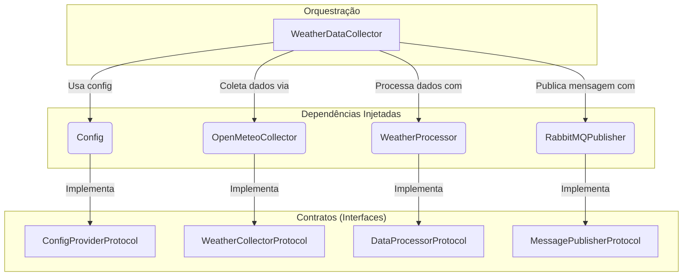
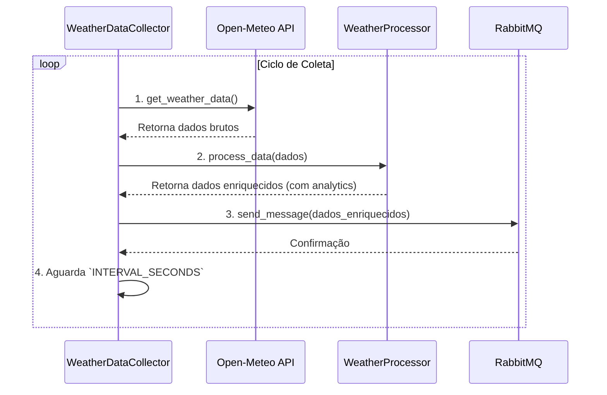
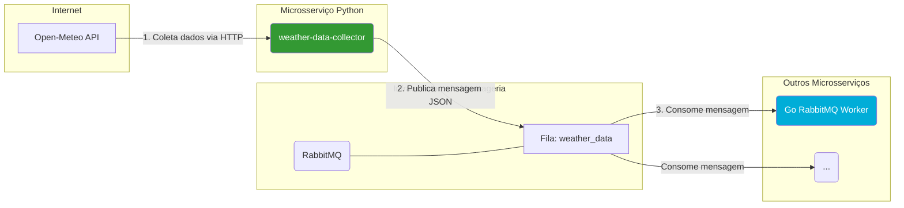

# Coletor de Dados Climáticos (weather-data-collector)

Este serviço é um componente essencial do ecossistema GDash, responsável por coletar, processar e publicar dados climáticos em tempo real. Desenvolvido em Python, ele opera de forma contínua para buscar informações de fontes externas, enriquecê-las e disponibilizá-las para outros microsserviços através de um sistema de mensageria.

## Visão Geral e Arquitetura

O `weather-data-collector` foi projetado com princípios de código limpo, componentização e inversão de dependência. Isso garante que cada parte do sistema tenha uma responsabilidade única e seja facilmente substituível ou testável.

### Principais Componentes

-   **`WeatherDataCollector` (main.py):** O orquestrador principal. Ele coordena o ciclo de vida da coleta, desde a busca dos dados até a publicação.
-   **`OpenMeteoCollector` (weather/collector.py):** Implementação concreta que busca dados da API [Open-Meteo](https://open-meteo.com/).
-   **`WeatherProcessor` (weather/processors.py):** Utiliza a biblioteca `pandas` para calcular estatísticas (médias, máximas, mínimas) e classificar as condições climáticas atuais.
-   **`RabbitMQPublisher` (messaging/rabbitmq.py):** Envia os dados processados para uma fila do RabbitMQ, garantindo a comunicação assíncrona com outros serviços.
-   **`interfaces/`:** Define os "contratos" (usando `Protocol` do Python) que cada componente deve seguir. Isso permite a injeção de dependência e desacopla as implementações concretas.

### Diagrama de Arquitetura Interna

O diagrama abaixo ilustra como os componentes internos se relacionam através da injeção de dependência.



## Fluxo de Dados do Ciclo de Coleta

O serviço opera em um loop contínuo. A cada intervalo de tempo configurado, o seguinte fluxo é executado:

1.  **Coleta:** O `OpenMeteoCollector` faz uma requisição HTTP para a API de previsão do tempo.
2.  **Processamento:** Os dados brutos são recebidos e o `WeatherProcessor` calcula análises (ex: temperatura média para as próximas 24h) e adiciona uma classificação (ex: "quente", "chuvoso", "agradável").
3.  **Publicação:** O `RabbitMQPublisher` converte os dados enriquecidos para o formato JSON e os publica na fila `weather_data` do RabbitMQ.
4.  **Espera:** O serviço aguarda o próximo ciclo.



## Integração no Ecossistema

Este serviço atua como um **Produtor** de dados. Ele alimenta o barramento de eventos (RabbitMQ), permitindo que qualquer outro serviço (**Consumidor**) se inscreva para receber as informações climáticas atualizadas.



## Configuração

O serviço é configurado através de variáveis de ambiente, seguindo as melhores práticas para aplicações em contêineres.

| Variável de Ambiente | Descrição | Padrão |
| -------------------- | ------------------------------------------------------------------------------------------ | ------------------------------- |
| `RABBITMQ_HOST` | Hostname do servidor RabbitMQ. | `localhost` |
| `RABBITMQ_PORT` | Porta do servidor RabbitMQ. | `5672` |
| `RABBITMQ_USER` | Usuário para autenticação no RabbitMQ. | *(obrigatório)* |
| `RABBITMQ_PASS` | Senha para autenticação no RabbitMQ. | *(obrigatório)* |
| `RABBITMQ_QUEUE` | Nome da fila para onde as mensagens serão publicadas. | `weather_data` |
| `LOCATION_NAME` | Nome da cidade para exibição. | `Recife, Brazil` |
| `LATITUDE` | Latitude geográfica para a coleta dos dados. | `-8.0542` |
| `LONGITUDE` | Longitude geográfica para a coleta dos dados. | `-34.8813` |
| `COLLECTION_INTERVAL`| Intervalo em segundos entre cada ciclo de coleta. | `300` (5 minutos) |
| `WEATHER_API_URL` | URL da API de clima. | `https://api.open-meteo.com/v1/forecast` |

## Instalação

1.  **Clone o repositório:**
    ```bash
    git clone https://github.com/eliezerlobaton/gdash-weather-challenge.git
    cd gdash-weather-challenge/packages/weather-data-collector
    ```

## Como Executar

Este serviço foi projetado para ser executado como um contêiner Docker, preferencialmente orquestrado pelo `docker-compose.yml` na raiz do projeto.

### Pré-requisitos
- Docker
- Docker Compose

### Executando com Docker Compose

Na raiz do monorepo, o serviço será iniciado automaticamente ao executar:
```bash
docker-compose up -d weather-data-collector
```

### Build Manual
Para construir a imagem Docker manualmente, execute o seguinte comando dentro do diretório `packages/weather-data-collector`:

```bash
docker build -t gdash/weather-data-collector .
```

### Dependências

-   **`requests`**: Para realizar as chamadas HTTP para a API externa.
-   **`pika`**: Cliente Python para interagir com o RabbitMQ.
-   **`pandas`**: Para análise e processamento de dados em memória.
